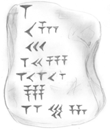

# Babylonian-Converter

Ce script Python est conçu pour convertir les nombres entiers en leur représentation babylonienne. Il a été créé pour accompagner le travail sur des activités issues de la banque de problèmes mathématiques proposée par le GT3|CSEN.



**Note sur la Notation Babylonienne** : ce script utilise une version simplifiée de la notation babylonienne. En particulier, la règle qui consiste à rassembler les symboles par étages de trois n'a pas été mise en œuvre pour simplifier le code. L'écriture est linéaire. 

Quelques commentaires à destination des professeurs par l'IREM de Montpellier ici : [https://irem.edu.umontpellier.fr/files/2018/05/explications-tablettes.pdf](https://irem.edu.umontpellier.fr/files/2018/05/explications-tablettes.pdf)

## Utilisation

**Pour les utilisateurs Windows**
Si vous utilisez Windows, vous pouvez simplement télécharger puis exécuter le fichier .exe fourni pour lancer l'application. Puis suivre les instructions à l'écran pour convertir un nombre en notation babylonienne.
[Télécharger l'application](https://github.com/romainbourdoncle/babylonian_converter/releases/download/Babylonian_converter1.0.0/babylonian_converter5.exe)

**Pour les utilisateurs macOS**
Si vous utilisez macOS, vous devez exécuter le code via le terminal. Télécharger le fichier nommé ```babylonian_converter5.py``` dans le dossier **src**. Exécuter le script et suivre les instructions à l'écran.

**Contribuer**
Un grand merci à Marie-Line Chabanol pour avoir transmis les activités, initialement créées par l'IREM de Montpellier, qui ont servi de base à ce projet.
